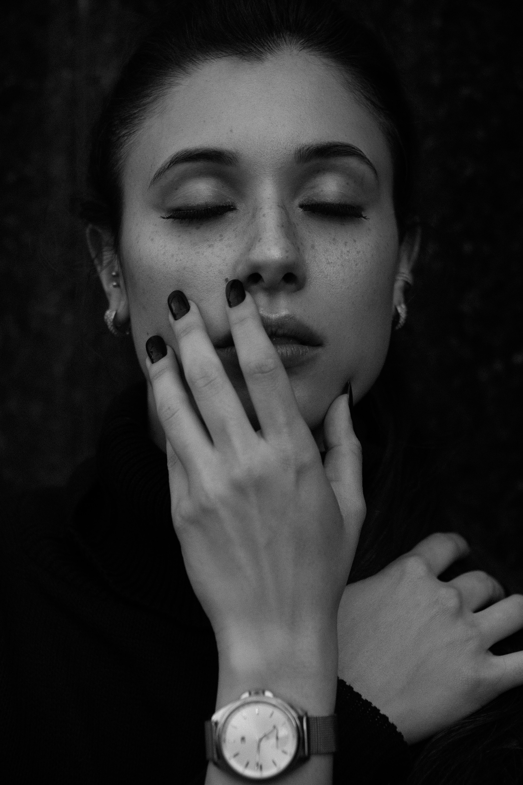
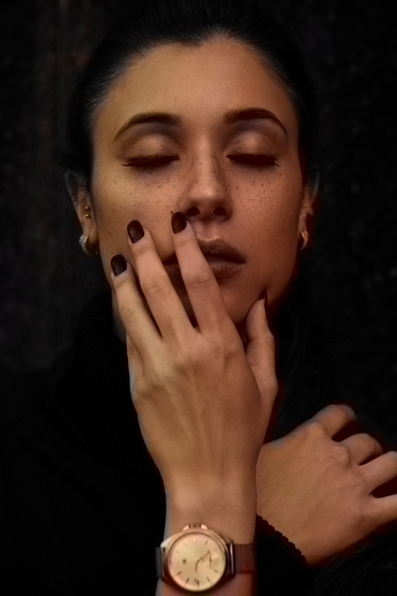

# Black & White to Colour

The Black and White to Colour script is a simple command line script that converts Black &amp; White images to colour. It works by converting an RGB colour space to a Lab colour space. The idea is based on a Zhang et al.'s [Colorful Image Colorization](http://richzhang.github.io/colorization/); utilising a Caffe deep learning model trained to predict ab values from L values. We then convert the Lab colour space back into RGB using OpenCV.

The meanings of L, a and b in the CIELAB (Lab) Colour space are as follows:

The ***L*** channel indicates the intensity of light 

The ***a*** channel indicates green-red values while 

The ***b*** channel indicates blue-yellow values 

## Note

Due to GitHub's free tier limits, I could not upload the Caffe model here. However, you can download it from [CodeSpeedy's Google Drive](https://drive.google.com/drive/folders/1FaDajjtAsntF_Sw5gqF0WyakviA5l8-a) . Add that model to the *model/* directory.

## Results

Photo by Adam White on Unsplash
 -> 

Photo by Dom Aguiar on Unsplash
 -> 

Photo by freestocks on Unsplash
 -> 
